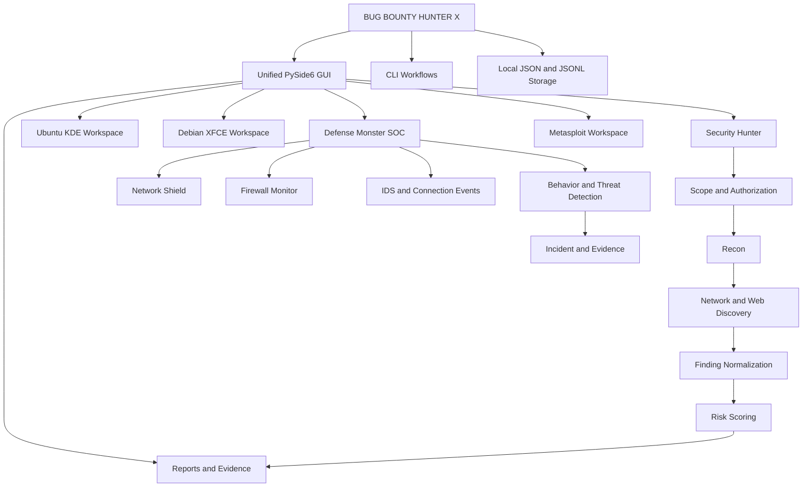
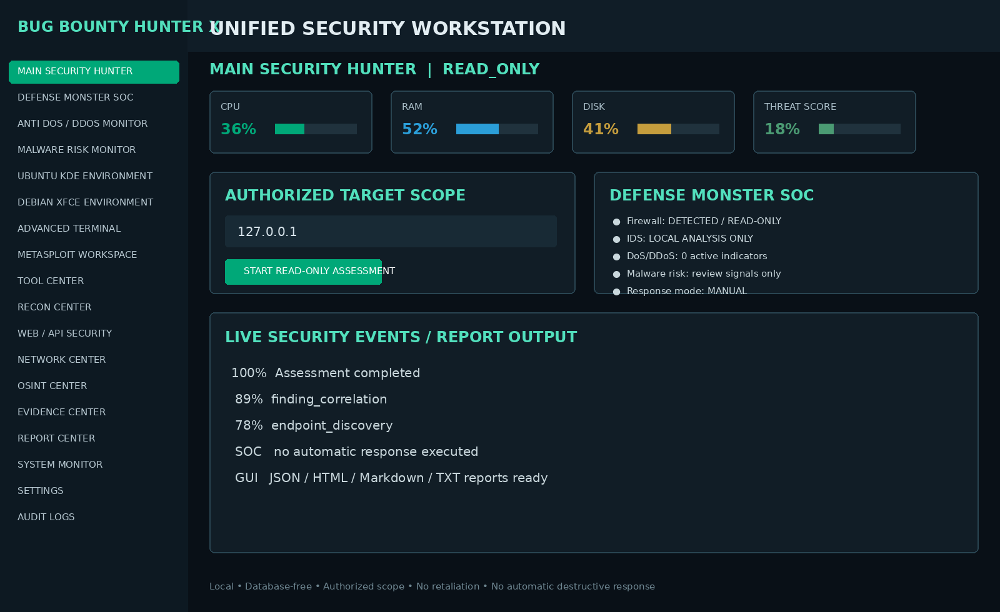
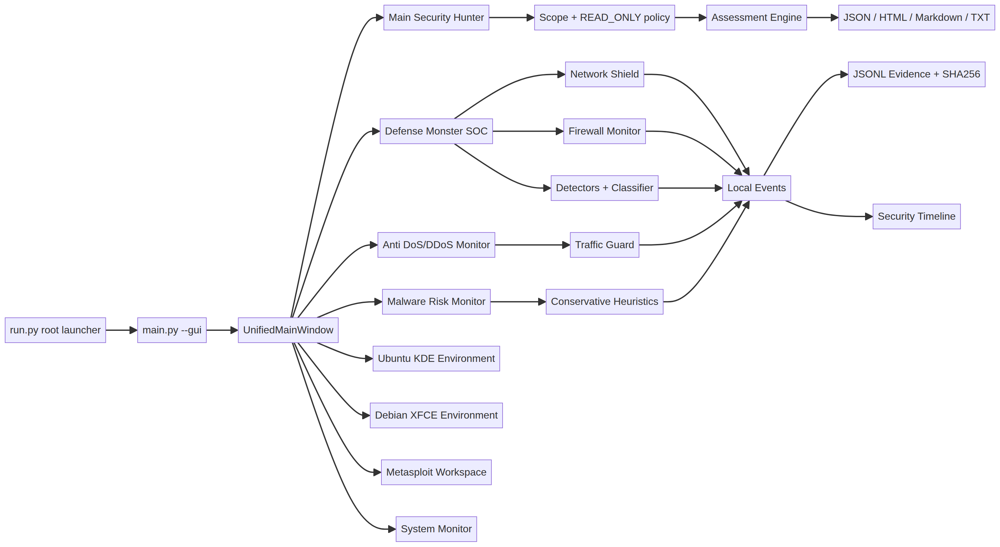

# BUG BOUNTY HUNTER X

## Advanced Kali Security Hunter + Defense Monster X

BUG BOUNTY HUNTER X is a local, modular cybersecurity research workstation for **authorized bug bounty programs, permitted penetration tests, CTFs, private laboratories, security research, defensive monitoring, and assessment reporting**.

The project combines a read-only security assessment engine, a multi-workspace desktop GUI, a 620-entry security-tool catalog, local JSON/JSONL evidence and reports, a layered defensive SOC named **DEFENSE MONSTER X**, and safe workstation services.

> **Important:** This project is not an uncontrolled attack platform. Use it only against assets that you own or are explicitly authorized to test. The default mode is `READ_ONLY`.

## Visual overview



## Defense-in-depth overview


### Actual GUI preview

The following PNG is a rendered preview of the unified GUI layout used by the application at runtime:



The following PNG is the rendered runtime data-flow view connecting the root launcher, unified shell, Security Hunter, Defense Monster SOC, traffic guard, malware monitor, evidence, and timeline:



The image assets are stored in `docs/images/` and are versioned with the repository so they display directly on GitHub.

## Main capabilities

| Area | Capability |
|---|---|
| Security Hunter | Authorized scope, read-only assessment workflow, recon, network/web assessment, findings, reports |
| Unified GUI | One application shell for all workspaces; no manual GUI launcher switching |
| Workspaces | Ubuntu KDE, Debian XFCE, Terminal, Metasploit, Security Engine, Local Server |
| Tool Center | 620 Kali-oriented catalog entries with availability detection and adapter metadata |
| Defense Monster | Network shield, firewall monitor, connection monitor, event correlation, behavior scoring, incidents, evidence |
| DoS/DDoS defense | Detects traffic-pressure indicators; does not attack, flood, retaliate, or auto-block by default |
| Malware monitoring | Conservative process/script-risk indicators; never claims a heuristic is proof and never auto-kills processes |
| Reporting | JSON, Markdown, HTML, TXT, JSONL evidence and local audit artifacts |
| Storage | Local filesystem only; no database, cloud database, or backend service dependency |

## Safety model

The platform uses several safety gates. The default authorization is `READ_ONLY`. Intrusive security operations require an explicit `AUTHORIZED` scope and `LAB_MODE`, and the current core does not provide arbitrary Internet exploitation. The secure command builder uses argv arrays, an executable allowlist, bounded timeout/output, sanitized environment variables, process cancellation, and no `shell=True`.

Firewall changes, blocking, containment, process termination, package installation, privileged operations, and incident transitions require explicit confirmation in reviewed integrations. Temporary response blocks expire by default and allowlists take precedence. There is no retaliation, counter-attack, DDoS, credential theft, persistence, ransomware behavior, or automatic destructive response.

A defense score and an IP reputation result are operational indicators, not proof that a system is secure or that a source is an attacker.

## Requirements

- Linux recommended: Ubuntu or Kali Linux
- Python 3.11 or newer
- A graphical desktop session for the PySide6 GUI
- Optional system tools such as Nmap, Nuclei, TShark, UFW, nftables, or iptables
- External tools are detected when available and are **not installed automatically**

PySide6, `psutil`, `pydantic`, `rich`, `httpx`, `packaging`, and `PyYAML` are listed in `requirements.txt`. System security tools are separate operating-system dependencies.

## Clone from GitHub

```bash
git clone https://github.com/chikalgaming213-eng/advanced-kali-security-hunter.git
cd advanced-kali-security-hunter
```

Check the current branch and repository state:

```bash
git branch --show-current
git status
```

## Installation

Create an isolated virtual environment:

```bash
python3 -m venv .venv
source .venv/bin/activate
python -m pip install --upgrade pip
pip install -r requirements.txt
```

On Debian/Ubuntu systems, if Python virtual environments are missing:

```bash
sudo apt update
sudo apt install python3-venv python3-pip
```

## Start the unified GUI

All GUI workspaces are opened through one application:

```bash
source .venv/bin/activate
python main.py --gui
```

The root launcher provides the same entry point plus the main local operations:

```bash
python run.py gui
python run.py scan 127.0.0.1 --report root_assessment
python run.py defense
python run.py monitor
python run.py project projects/example-program --name "Example Program" --program "Authorized Bug Bounty"
python run.py test
```

Run these commands from the repository root. The launcher uses the current Python interpreter and does not require manual directory changes between GUI or backend components.

The left navigation provides the following pages:

- Main Security Hunter
- Defense Monster SOC
- Anti DoS/DDoS Monitor
- Malware Risk Monitor
- Ubuntu KDE Environment
- Debian XFCE Environment
- Advanced Terminal
- Metasploit Workspace
- Tool Center
- Recon Center
- Web/API Security
- Network Center
- OSINT Center
- Evidence Center
- Report Center
- System Monitor
- Settings
- Audit Logs

The Ubuntu KDE and Debian XFCE pages are logical workspaces inside the application. They display environment and host state; they do not claim to boot another operating system inside PySide6.

## CLI usage

Run the default localhost read-only assessment:

```bash
python main.py
```

Assess an explicitly authorized local target and generate reports:

```bash
python main.py 127.0.0.1 --report localhost
```

Use the composable workflow CLI:

```bash
python -c 'from cli_features import dispatch; dispatch(["scan", "127.0.0.1", "--name", "workflow"])'
```

Reports are written under `data/reports/` in JSON, Markdown, HTML, and TXT formats.

## Portable project system

Projects are ordinary folders and can be copied, archived, reviewed, or moved between authorized workstations. The project manager creates `project.json`, JSONL streams for targets, assets, findings, jobs, and events, plus `evidence/`, `scans/`, `reports/`, and `logs/` directories. No database is required.

```bash
python run.py project projects/program-a --name "Program A" --program "Authorized Program A"
```

All future tool executions are intended to pass through the guarded pipeline: target validation, explicit scope, authorization, policy, rate limit, command validation, bounded execution, parser, and evidence. An out-of-scope target is blocked before command execution.

## Bug Bounty Hunter workflow combination

The recommended combination is **scope → authorization → passive recon → low-impact discovery → normalization → correlation → scoring → evidence → report**.

### 1. Prepare the program scope

Create an explicit target list from the authorized bug bounty policy. Record allowed domains, URLs, CIDRs, exclusions, rate limits, and testing windows. Do not add wildcard targets unless the program explicitly authorizes them.

Use the default read-only scope first:

```bash
python main.py authorized.example --report program_initial
```

### 2. Use the Recon Center

Combine the catalog and adapters for passive or low-impact collection. Typical combinations are:

| Goal | Suggested combination | Output |
|---|---|---|
| Domain inventory | Amass/Subfinder/Assetfinder metadata + scope validator | Asset observations |
| DNS review | Dig/Host/WHOIS adapters + local parser | DNS and ownership evidence |
| HTTP inventory | HTTPX/Katana metadata + URL models | URLs, status, titles, technologies |
| Network review | Nmap/Naabu metadata + port/service models | Authorized host and service observations |
| Web review | Nuclei/Nikto/FFUF adapter metadata in permitted scope | Normalized observations and findings |

The platform should not run every tool blindly. Select a profile, respect rate limits, verify scope, and preserve the raw output as evidence when the engagement permits it.

### 3. Normalize and correlate findings

External output can be parsed without executing the originating tool:

```python
from tools.parsers import ToolOutputParser
from vulnerability.normalizer import FindingNormalizer

parser = ToolOutputParser()
records = parser.parse_nuclei_jsonl(raw_jsonl)
observations = parser.to_observations(records)
findings = FindingNormalizer().normalize_many(observations)
```

Risk prioritization is transparent and combines severity, confidence, exposure, and exploitability indicators:

```python
from vulnerability.scoring_engine import RiskScorer
ranked = RiskScorer().rank(findings)
```

### 4. Preserve evidence

Use local JSONL and evidence directories. Do not store credentials or unnecessary personal data. Evidence collection records timestamps, source, collector, and SHA256 where applicable.

### 5. Generate the report

```python
from pathlib import Path
from reporting.generator import ReportGenerator

ReportGenerator(Path("data/reports")).write(findings, "authorized_assessment")
```

### 6. Keep intrusive testing isolated

Any intrusive validation must be separately authorized, limited to a lab or explicit scope, reviewed before execution, and logged. The platform defaults to safe read-only behavior and does not perform arbitrary exploitation.

## Defense Monster SOC usage

Inspect the local defensive posture:

```bash
python defense_cli.py snapshot
python defense_cli.py firewall
python defense_cli.py score
```

The SOC backend monitors interfaces, routes, connections, firewall availability, threat indicators, behavior signals, evidence, and timelines. Missing tools or insufficient privileges produce an unavailable status rather than crashing.

### Anti DoS/DDoS monitoring

The traffic guard tracks connection pressure, failed connections, many ports, and time windows. It produces indicators such as `DOS_DDOS_INDICATOR` with score, confidence, ports, timestamps, and rationale. It does not send traffic, block an IP, launch a counterattack, or make a DDoS response.

### Malware-risk monitoring

The malware monitor uses conservative heuristics for suspicious process strings, temporary execution paths, known reviewed hash matches, and risky script patterns. Results are labeled as review indicators. They are not automatic malware verdicts. Processes are not terminated automatically.

## Workstation and monitoring commands

```bash
python workstation_cli.py environments
python workstation_cli.py monitor
python workstation_cli.py graph --output data/reports/asset_graph.json
```

## Testing and validation

Run all tests:

```bash
python -m pytest -q
```

Validate compilation:

```bash
python -m compileall -q .
```

Validate JSON files:

```bash
python -c 'import json; from pathlib import Path; [json.loads(p.read_text()) for p in Path(".").rglob("*.json")]; print("JSON valid")'
```

## Repository layout

```text
advanced_kali_security_hunter/
├── main.py
├── defense_cli.py
├── workstation_cli.py
├── config/
├── core/
├── defense/
├── evidence/
├── gui/
├── models/
├── network/
├── osint/
├── recon/
├── reporting/
├── tools/
├── vulnerability/
├── web/
├── workstation/
├── tests/
└── data/
    ├── defense/
    ├── evidence/
    ├── logs/
    └── reports/
```

## Troubleshooting

### `No module named PySide6`

Activate the virtual environment and install the dependencies:

```bash
source .venv/bin/activate
pip install -r requirements.txt
python main.py --gui
```

### GUI does not appear over SSH

Use a desktop session, X11 forwarding, VNC, or remote desktop. For X11 forwarding:

```bash
ssh -X user@host
cd advanced-kali-security-hunter
source .venv/bin/activate
python main.py --gui
```

### Tool is missing

The Tool Center reports missing tools and does not install them automatically. Install system packages manually after reviewing the operating-system package and authorization requirements.

### Firewall status is unavailable

Some firewall commands require elevated privileges. The monitor is intentionally read-only and will report unavailable data rather than requesting or storing a password.

### Permission errors during process or connection monitoring

Linux restricts some process and socket metadata. Run with ordinary user privileges first. Do not grant broad privileges merely to improve a dashboard; use least privilege and review the data source.

## Development guidelines

New tools must be added through catalog metadata plus a reviewed adapter. New commands must use `CommandSpec` and the secure executor. New response actions must require an explicit policy decision, confirmation, and audit record. Add mocked tests for parsers, detectors, response gates, and report generation.

## License and responsible use

Use this project only for lawful, authorized security work. The repository owner is responsible for obtaining permission, defining scope, protecting evidence, and complying with applicable law and program policy.
